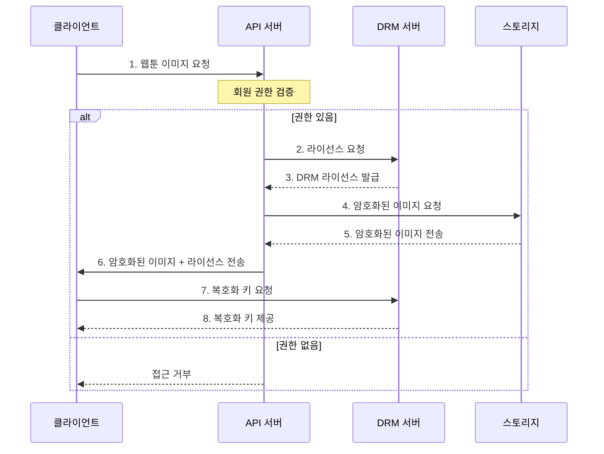

## Requirements
1. DRM을 사용한 사용자 인증 제어가 반영되어야 한다.
2. 자격 있는 회원만 웹툰 이미지를 조회할 수 있다.

## diagram

## 개념정리
### DRM 공급자
> pallycon 같은 중간 공급자가 필요한 이유는? 
> 플레이어에게 해당 콘텐츠 라이선스가 발급하는 역할?

### SPEKE

### Amazon CloudFront 보안
- 특정 콘텐츠에 대한 접근 제한 
- 인증된 사용자만 콘텐츠에 접근 가능  

이를 지원하는 두가지 방법으로 Signed URL, Signed Cookie가 있다. 
 
#### Signed URL
일반적인 콘텐츠 및 RTMP 서비스 사용시 권장한다. 

#### Signed Cookie
DASH, HLS와 같은 manifest file을 사용하는 미디어 재생 서비스에 권장한다.

### 참고
- [AWS Elemental MediaConvert및 Amazon CloudFront를 활용한 미디어 콘텐츠의 보안 강화 전략 – Part 2: VOD](https://aws.amazon.com/ko/blogs/tech/vod-media-security-on-aws/) 

