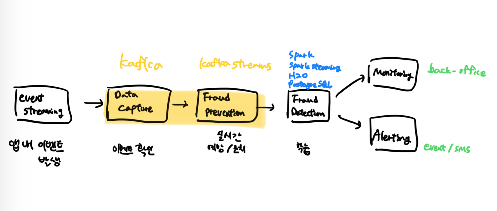

# Requirements

## Functional

**FDS 특징**

- 데이터 수집
- 데이터 전처리
- 조건/규칙 설정
  - 오용탐지 (기존 특징을 조건화, 규칙화) => Rule 기반
  - 이상탐지 (특이점 탐지) => AI 기반
- 실시간 모니터링/감사
- 알림
- 보고서/시각화

## Non-Functional

## Estimates

## Design

  
Capture&Prevention

- Apache Flink
  - 장점
    - 실시간 처리 및 일괄 배치
    - 시간기반 처리 지원으로 데이터 지연 및 순서 관리
    - 내부 상태 관리를 통한 결과 일관성 보장
  - 단점
    - 대규모 클러스터 필요
- Apache Kafka Streams
  - 장점
    - Kafka 클러스터와 함께 확장 가능
    - Java 라이브러리로 구현됨
    - Exactly-once 보장
    - 상태 기반 처리 (RocksDB)
  - 단점
    - 일부 복잡한 처리작업엔 기능 제한적
    - 컨슈머 그룹으로 처리하기 때문에 하나의 지연으로 Streams 전체 처리 속도에 영향을 줌

## Reference

### 함께 논의하고 싶은 주제

- AWS CloudWatch 모니터링
  - 특정 메트릭이 임계값 초과/이상탐지의 경우 알림 보내기 가능
- AWS WAF
  - 액세스 로그를 쌓고 분석을해서 ACL 조건에 따라 특정액션(Block/Allow/Count) 등이 가능함
  - 의심스러운 패턴을 감지하고 대응하는 부분이 FDS와 유사

### 참고하기 좋은 기술 사례

[FDS 논문](https://thesai.org/Downloads/Volume14No6/Paper_80-End-to-End%20Real-time%20Architecture%20for%20Fraud%20Detection.pdf)  
[CDC를 활용한 FDS](https://medium.com/@mayilb77/design-financial-fraud-detection-system-based-on-cdc-change-data-capture-technology-and-real-time-9f2c47d24054)  
[관련책(ch6)](https://www.oreilly.com/library/view/streaming-architecture/9781491953914/)  
[KafkaStreams 이상탐지 시스템](https://medium.com/musinsa-tech/%ED%97%88%ED%8A%BC%EC%A7%93%EC%9D%80-%EA%B7%B8%EB%A7%8C-kafka-streams%EB%A5%BC-%ED%99%9C%EC%9A%A9%ED%95%9C-%EC%8B%A4%EC%8B%9C%EA%B0%84-%EC%9D%B4%EC%83%81-%EB%A1%9C%EA%B7%B8%EC%9D%B8-%EA%B0%90%EC%A7%80-%EC%8B%9C%EC%8A%A4%ED%85%9C-%EB%8F%84%EC%9E%85%ED%95%98%EA%B8%B0-d05768b78c86)
