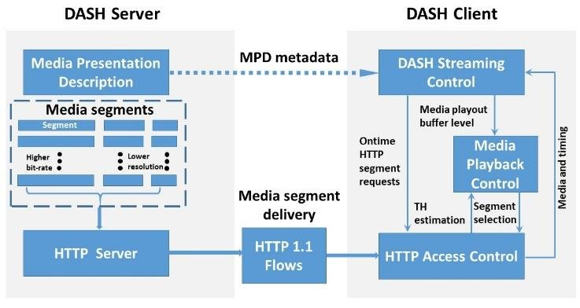

## Requirements
* 사용자가 선택한 동영상을 끊김없이 스트리밍한다.
* 사용자의 선택 또는 네트워크 상태에 따라 동영상 화질을 다르게 제공한다.

## Tech Stack
### MPEG-DASH 

이미지 출처 : [A Network Paradigm for Very High Capacity Mobile and Fixed Telecommunications Ecosystem Sustainable Evolution](https://www.researchgate.net/publication/343088672_A_Network_Paradigm_for_Very_High_Capacity_Mobile_and_Fixed_Telecommunications_Ecosystem_Sustainable_Evolution)

## References
* [What is MPEG-DASH Video Streaming Protocol? How Does MPEG-DASH Work?](https://ottverse.com/mpeg-dash-video-streaming-the-complete-guide/#content)
* [Cloudflare - What is MPEG-DASH ](https://www.cloudflare.com/ko-kr/learning/video/what-is-mpeg-dash/)
* [System Design of Netflix](https://medium.com/@lazygeek78/system-design-of-netflix-8a31bf9ca53f)
* [Netflix Hystrix를 이용한 MSA 회복성 패턴 톺아보기](https://dev.gmarket.com/40)