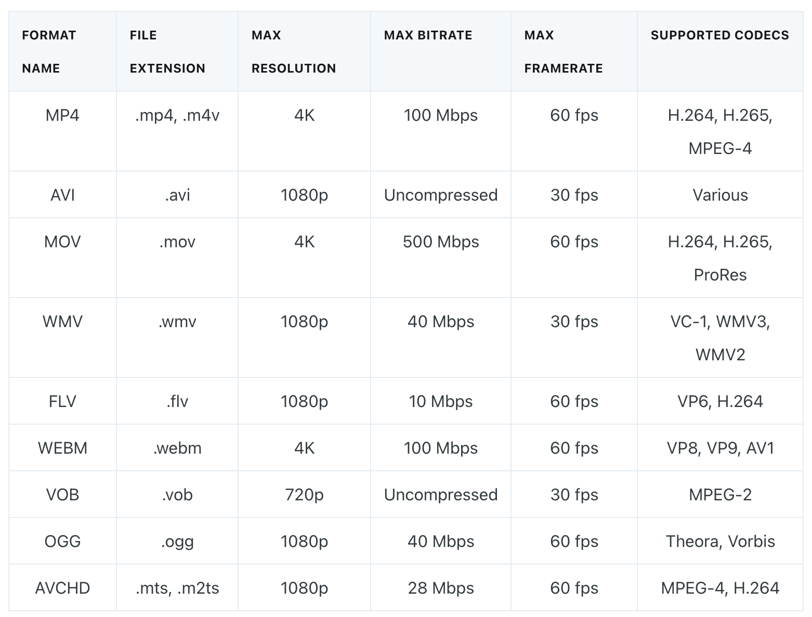

# Requirements

## Functional

1. 네트워크 연결이 중단되어도 볼수있도록 미리 로드(버퍼링)
2. 전세계적으로 실시간 데이터 지속 전달이 가능
3. 기기별 네트워크 속도에 따른 미디어 화질 최적화

## Non-Functional

1. 실시간 끊김이나 지연이 적어야 함
2. 지리적 요인으로 인한 스트리밍 속도가 저하되지 않아야 함
3. 미디어 내용 분석을 통한 필터링 및 제한 표시

## Estimates

## Design

### 기본 필수 과정

> source -> stream ingestion (압축&인코딩&분할) -> stream storage -> stream processing(cdn 배포) -> destination(디코딩)

#### 상황별 추천 조합

1. 온라인 비디오
   - H.265, VP9 코덱, 적응형 비트레이트 스트리밍(ABS) 사용, CDN 사용
2. 오프라인 비디오
   - ProRes, DNxHD 로 파일크기 감소 및 고품질 유지, 저장매체를 고려하여 호환되는 비디오 형식 선택
3. 모바일 장치
   - 제한된 대역폭에 맞는 최적화된 비디오 제공, H.264(+Baseline 프로파일) 조합은 오래된 모바일 기기 대상으로 설계 됨, ABS 사용
4. 라이브 스트리밍
   - H.264 등 낮은 지연성 코덱 추천, 기기별 호환성 고려, 적절한 비디오 비트레이트 사용

#### 코덱 타입

- 무손실: Apple ProRes, FFV1
- 손실: H.264, MPEG-4

#### 코덱과 파일 포맷 확인

#### 비디오 품질 및 파일 크기를 찾는 고려사항

1. 코덱 선택: 요구사항 충족을 위한 것으로 선택
2. 적절 설정값 확인: 해상도 별 비트레이트 최적값 확인
3. 가변 비트레이트 사용: 복잡성에 따라 비트레이트 조정
4. Interframe Compression 사용: Intraframe Compression 보다 더 높은 품질과 압축률 보장
5. 과도한 압축 피하기: 품질과 파일 크기의 균형을 맞출 것
6. 적응형 비트레이트 스트리밍 고려: 다양한 장치나 시청 환경에 따라 해상도 변형을 제공할 것

#### 비디오 품질의 영향을 주는 요소

1. 비디오 해상도: 프레임 구성을 위한 픽셀 수 크기가 클 수록 해상도가 높음
2. 프레임 속도: 움직임이 많고 자연스러울수록 높음
3. 비트레이트: 1초 비디오 인코딩에 필요한 비트 수, 높을 수로 초당 처리율이 높아져 품질 향상
   - 너무 높아지다 보면 품질 증가가 더뎌지고 파일 크기가 커질 수 있음

### HLS 알아보기

#### 인코딩 결과물

1. Fragmented MPEG-4 (fMP4) File
   1. segment 순차적 다운로드 후 재생
   2. 확장자 `.m4s`
2. MPEG-2 전송 스트림(Transport stream)
   1. 주로 라이브 이벤트에 사용
   2. 여러 개의 패킷으로 분할하여 전송
   3. 확장자 `.ts`

#### 클라이언트에게 보여주는 과정

1. 스트림 URL을 통해 인덱스 파일 가져오기
2. 인덱스 파일 내 값 확인
3. 스트림에서 미디어 파일 다운
4. 파일을 조합하여 스트림 제공

인덱스 파일 확인시 마지막 `EXT-X-ENDLIST`까지 계속 진행 필요. 해당 태그가 없다면 라이브 방송.

#### 인덱스 파일 내 segment 목록 갱신 프로세스

1. 주기적으로 인덱스 파일 업데이트
2. 특정 시간 간격으로 segment 갯수별 업데이트
3. 시간 기반 segment 수명 설정
4. 신규 segment 감지로 업데이트

#### 인덱스파일(`.m3u8`=playlist file)

- EXT-X-PLAYLIST-TYPE: [EVENT|VOD]
- segment 파일 위치는 '상대 경로'를 사용하여 이식성을 높이고 텍스트 길이 최소화 하는 것을 추천

#### 1.live playlist(sliding window)

- 실시간 추가 가능

#### 2. event playlist

- 정적이고, 세그먼트가 미리 생성되어 이벤트 동안 고정
- 추가적인 세그먼트는 불가능
- 스포츠 같은 이벤트의 어떤 지점이던 이동하여 시청 가능

### CDN이 중요한 이유

1. 대역폭
   - 모든 요청을 원본 지점에서 가져오려는 경우 병목지점으로 스트리밍 속도가 느려짐
2. 글로벌 컨텐츠 전송
   - cdn이 전세계에 분산 되어있어서 캐싱으로 빠르게 가져올 수 있음
3. 대기 시간 및 RTT 감소
   - 원본 소스보다 가깝게 제공하여 왕복시간(RTT) 감소
4. 워크로드
   - 원본서버 워크로드 과부하 감소
5. 캐싱
   - 세그먼트 캐싱

## Reference

### 함께 논의하고 싶은 주제

https://hygraph.com/blog/video-streaming-architecture

[틱톡 아키텍쳐](https://www.techaheadcorp.com/blog/decoding-tiktok-system-design-architecture/)  
[스트리밍 프로토콜 종류 및 설명](https://www.dacast.com/blog/streaming-protocols/)  
[HLS에 대한 자세한 설명 한국블로그](https://medium.com/@hongseongho/introduction-to-hls-e7186f411a02)  
[라이브 스트리밍에서의 CDN의 필요성](https://www.cloudflare.com/ko-kr/learning/video/what-is-live-streaming/)  
[코덱 이해를 위한 블로그](https://imagekit.io/blog/video-encoding/)  
[Google Cloud Video Intelligence 클라이언트 라이브러리 - 실시간 유해성 콘텐츠 감지](https://cloud.google.com/video-intelligence/docs/analyze-safesearch?hl=ko#video_analyze_explicit_content-python)
