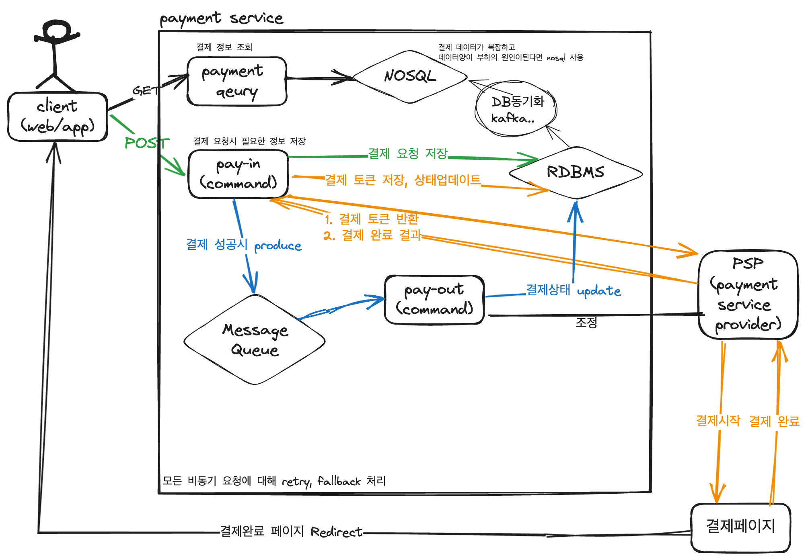

## Requirements
### Functional
* 판매자를 대신해 결제서비스를 결제자에게 제공한다.
* 판매자는 거래 이후 정산된 금액을 확인할 수 있다.
### Non-Functional
* 결제는 중복으로 발생해선 안되며, 결제 오류시 결제 트랜잭션이 롤백되어야 한다.
* 결제 정보는 신뢰성을 보장해야 한다. (서버간 결제 정보가 다르면 안된다)
### Estimates
* 하루 300만 트랜잭션 ([배민 일평균 주문량](https://www.youtube.com/watch?v=704qQs6KoUk&t=857s&ab_channel=%EC%9A%B0%EC%95%84%ED%95%9C%ED%85%8C%ED%81%AC))
* 약 30TPS
## Design


## API
1. 결제 요청
  * POST /v1/payments
    ```json
    request: {
        "order_info": json,
        "order_uuid": string,
        "payment_info": json
    }
2. 결제 정보 조회
  * GET /v1/payments/{payment_uuid}
    ```json
    response: {
        "payment_uuid": string,
        "order_info": json,
        "order_uuid": string,
        "payment_info": json
    } 
3. 결제 상태 업데이트 웹훅
   * POST /v1/payments/webhook  

## Message Queue
* 결제 완료 이후 처리에 대한 비동기 처리
  * 결제 요청 -> PSP -> 결제 성공에 대한 이벤트: 결제 완료 이후 비지니스 로직 처리

## Batch
* 결제자-판매자의 거래 이력과 PSP에 결제된 이력에 대한 일치/불일치 검증

## Reference

### 함께 논의하고 싶은 주제
* 외부 의존적인 서비스 때문에 장애 대처한 경험
* EDA 에서 트랜잭션 실패시 롤백에 대한 설계 경험

### 참고하기 좋은 기술 사례
* [대규모 트랜잭션을 처리하는 배민 주문시스템 규모에 따른 진화](https://www.youtube.com/watch?v=704qQs6KoUk)
