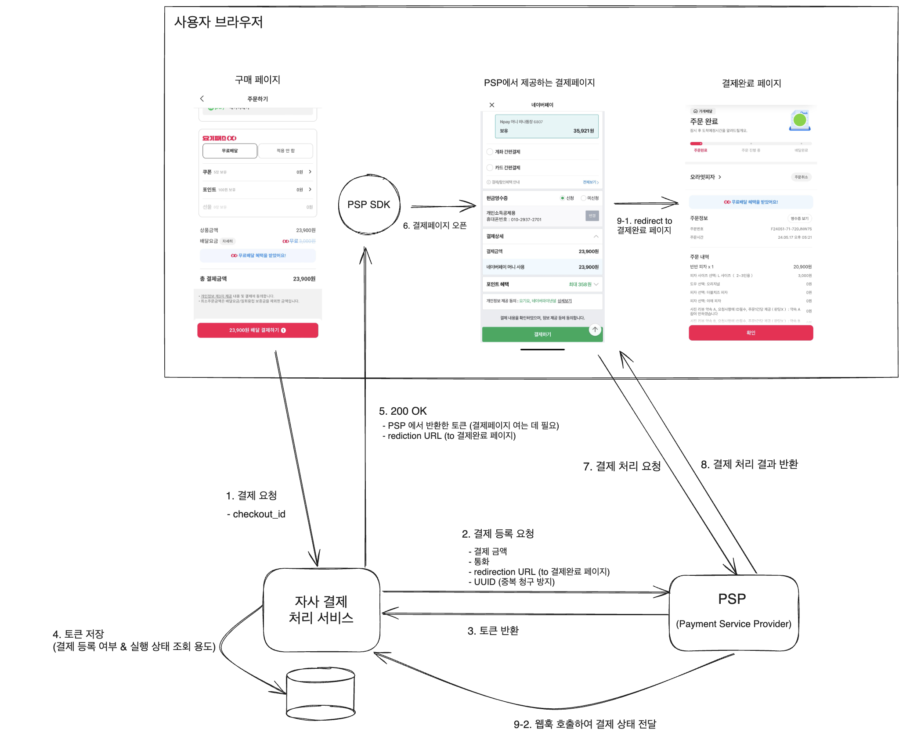
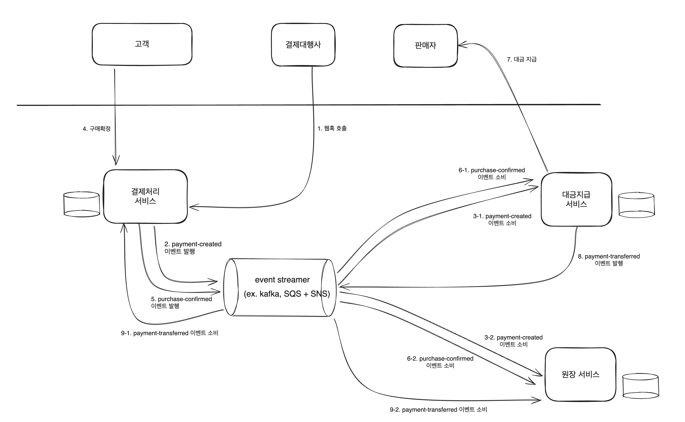

## Functional Requirements
* 고객은 결제를 정상적으로 할 수 있어야 한다.
* 결제 수단은 1가지 이상이어야 한다. (네이버페이, 신용카드, 페이코..)
* 고객이 제품을 수령하면 결제 대금이 판매자에게 지급되어야 한다.

## Non-Functional Requirements
1. 결제 금액을 위/변조할 수 없어야 한다.
2. 결제 주기 내에 일부가 실패하더라도 재시도하거나 후 보정을 통해 가능한 결제완료 처리를 해야 한다.
3. 동일한 요청에 대해 멱등성을 보장해야 한다. (결제 1개에 대해 고객에게 중복으로 청구되지 않아야 한다.)

## Estimations
* DAU = 100만으로 가정 (FYI, [쿠팡이츠 & 요기요 DAU = 100만, 배달의민족 DAU = 600만](https://www.mk.co.kr/news/business/10954092))
* 유저 당 평균 일일 주문 수 = 1건 
* TPS(Transaction Per Second) = 100만 / 60 * 60 * 24 ≈ 11

## APIs

#### 결제 요청

* method: `POST`
* path: `/v1/payment`
* request body

    | key           | value         | description         |
    | -------------------- |---------------|---------------------|
    | checkout_id          | string          | 구매 식별자           |

### 결제 완료 페이지
* method: `GET`
* path: `/v1/payment?token={PSP에서 반환한 토큰}`

## Design

### diagram

* `1. 결제 금액을 위/변조할 수 없어야 한다.`  
  * PSP 에서 제공한 토큰에 결제 금액이 암호화되어 있으므로 위/변조 방지 가능.
* `2. 결제 주기 내에 일부가 실패하더라도 재시도하거나 후 보정을 통해 가능한 결제완료 처리를 해야 한다.`
  * 자사결제처리서비스 ~ PSP 간의 타임아웃 & 재시도 횟수 & 재시도 간격 협의.
* `3. 동일한 요청에 대해 멱등성을 보장해야 한다. (결제 1개에 대해 고객에게 중복으로 청구되지 않아야 한다.)` 
  * 사용자 -> 결제처리서비스 : 결제 요청 시 전달하는 `checkout_id` 으로 재시도에 의한 중복 처리 방지.
  * 결제처리서비스 -> PSP : 결제 등록 요청 시 전달하는 UUID 으로 재시도에 의한 중복 처리 방지.

[질문]
* `2. 결제 등록 요청` 단계에서 PSP 에게 왜 리다이렉션 URL 줘야 하는지?
* PSP 레이턴시가 길어지면 자사 결제처리 서비스의 레이턴시에도 영향을 줄텐데, 사용자 ~ 자사 결제처리서비스 ~ PSP 간의 비동기 통신이 가능한지?
* 결제 처리 과정에서 DLQ 가 사용되는 구체적인 상황이 궁금합니다.

## Reference
[가상 면접 사례로 배우는 대규모 시스템 설계 기초 2](https://product.kyobobook.co.kr/detail/S000211656186)

-----

## [Additional] Payment System

### events
* `payment-created` : 결제 정보가 생성됨
* `purchase-confirmed` : 고객이 제품 구매를 확정함
* `payment-transferred` : 결제 대금이 판매자에게 지급됨

### diagram

