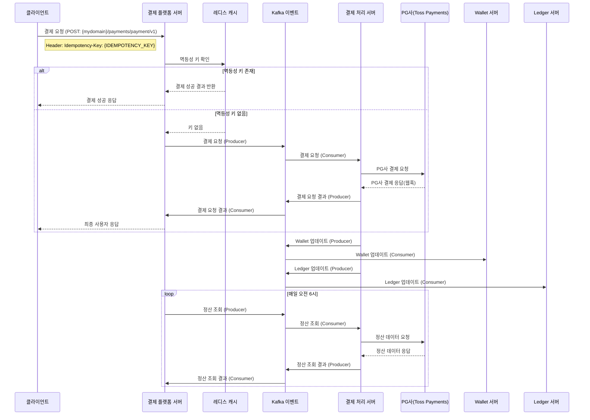

# 결제 시스템 아키텍처

```mermaid
sequenceDiagram
    participant Client as 클라이언트
    participant PaymentPlatformServer as 결제 플랫폼 서버
    participant Redis as 레디스 캐시
    participant Kafka as Kafka 이벤트
    participant PaymentProcessingServer as 결제 처리 서버
    participant PGSite as PG사(Toss Payments)
    participant WalletServer as Wallet 서버
    participant LedgerServer as Ledger 서버

    Client->>PaymentPlatformServer: 결제 요청 (POST: {mydomain}/payments/payment/v1)
    note right of Client: Header: Idempotency-Key: {IDEMPOTENCY_KEY}
    PaymentPlatformServer->>Redis: 멱등성 키 확인
    alt 멱등성 키 존재
        Redis-->>PaymentPlatformServer: 결제 성공 결과 반환
        PaymentPlatformServer-->>Client: 결제 성공 응답
    else 멱등성 키 없음
        Redis-->>PaymentPlatformServer: 키 없음
        PaymentPlatformServer->>Kafka: 결제 요청 (Producer)
        Kafka->>PaymentProcessingServer: 결제 요청 (Consumer)
        PaymentProcessingServer->>PGSite: PG사 결제 요청
        PGSite-->>PaymentProcessingServer: PG사 결제 응답(웹훅)
        PaymentProcessingServer->>Kafka: 결제 요청 결과 (Producer)
        Kafka->>PaymentPlatformServer: 결제 요청 결과 (Consumer)
        PaymentPlatformServer-->>Client: 최종 사용자 응답
    end

    PaymentProcessingServer->>Kafka: Wallet 업데이트 (Producer)
    Kafka->>WalletServer: Wallet 업데이트 (Consumer)
    PaymentProcessingServer->>Kafka: Ledger 업데이트 (Producer)
    Kafka->>LedgerServer: Ledger 업데이트 (Consumer)

    loop 매일 오전 6시
        PaymentPlatformServer->>Kafka: 정산 조회 (Producer)
        Kafka->>PaymentProcessingServer: 정산 조회 (Consumer)
        PaymentProcessingServer->>PGSite: 정산 데이터 요청
        PGSite-->>PaymentProcessingServer: 정산 데이터 응답
        PaymentProcessingServer->>Kafka: 정산 조회 결과 (Producer)
        Kafka->>PaymentPlatformServer: 정산 조회 결과 (Consumer)
    end

```
