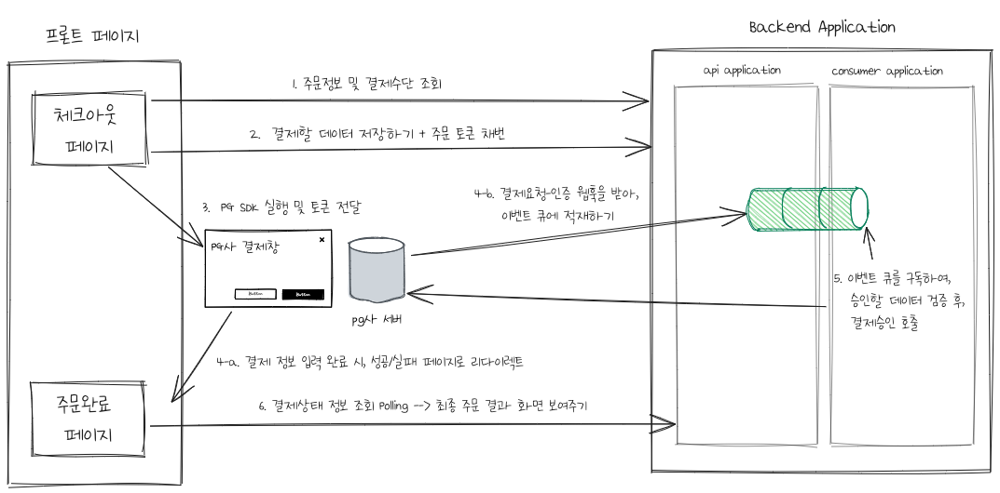

##Requirements
  ### Functional
  * 
  * 
  *
  ### Non-Functional
  * 
  * 
  *
  ### Estimates
  * 
  * 
  *
## Design

## API
1. 체크아웃/결제수단조회 
2. 주문접수
3. 결제상태조회 
4. 결제요청-인증 webhook

## Consumer
* 결제요청-인증 이벤트 구독 

## Batch
* 승인대사 배치 

## Reference
* tosspayments 개발자센터
  * [결제흐름 이해하기](https://docs.tosspayments.com/guides/learn/payment-flow#%EA%B8%B0%EB%B3%B8-%EA%B0%9C%EB%85%90-%EC%9A%94%EC%B2%AD-%EC%9D%B8%EC%A6%9D-%EC%8A%B9%EC%9D%B8) 
  * [redirect url](https://docs.tosspayments.com/reference/js-sdk#%EA%B2%B0%EC%A0%9C-%EC%9A%94%EC%B2%AD-%EC%9D%91%EB%8B%B5-%EC%B2%98%EB%A6%AC)
  * [webhook 개념](https://docs.tosspayments.com/resources/glossary/webhook)
  * [webhook 상세](https://docs.tosspayments.com/guides/webhook)
* [요즘IT: 이커머스 페이지 기획 시 알아야 하는 기본 용어](https://yozm.wishket.com/magazine/detail/664/)

## 이어서 
### 함께 논의하고 싶은 주제 
- PG 이중화 
  - ref. [배달의민족 기술블로그: 외부 시스템 장애에 대처하는 우리의 자세](https://techblog.woowahan.com/6447/)
  - 관련 키워드: #circuit breaker #벤더이중화 
- 결제장애대응
   - ref. [배달의민족 기술블로그: 결제 담당자가 장애에 대응하는 방법](https://techblog.woowahan.com/15236/) 
- 결제승인연동 실패 케이스 대사작업 
   - ref. [tosspayments 개발자센터: 거래와 대사작업](https://docs.tosspayments.com/reference#%EA%B1%B0%EB%9E%98)   

### 참고하기 좋은 기술 사례
* [우아콘: 대규모 트랜잭션을 처리하는 배민 주문시스템 규모에 따른 진화](https://www.youtube.com/watch?v=704qQs6KoUk)

