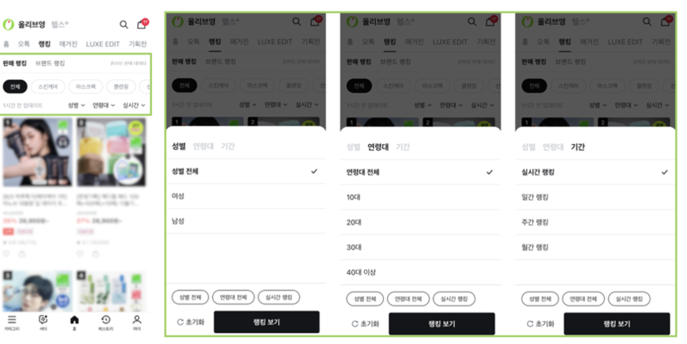

## Functional Requirements
* 랭킹 페이지에서 사용되는 집계 데이터를 적재해야한다.
   * 
* 집계 데이터는 성별 x 연령 x 기간 조건으로 필터링할 수 있어야한다. 
  * 기간의 종류는 다음과 같다.
    * 실시간
    * 일간
    * 주간 
    * 월간

## Non-Functional Requirements
* 주문 데이터가 급증하는 세일기간에도 처리 속도가 지연되면 안된다.   
   * AWS Glue 병렬화 수준 조정을 통해 해결할 수 있다. 

## Estimates
* TBD 

## 정리할 내용
* AWS
  * Amazon EventBridge  
  * Glue
  * Glue Catalog
  * Athena S3 
    * Event Notification의 종류 
  * Lambda
* Parquet (파케이) 
  * 데이터 구조 특징 
 

## 이어서 
### 함께 논의하고 싶은 주제
* Glue를 활용한 데이터 파이프라인 모니터링
  * Amazon EventBridge -> Amazon SNS 이벤트 발행 -> CloudWatch에서 구독 + 임계치 이상 발생 시 -> 슬랙 알럿 
 

### 참고하기 좋은 기술 사례
* [CJ 올리브영의 서버리스 랭킹 시스템 구축기](https://aws.amazon.com/ko/blogs/tech/oliveyoung-serverless-ranking-system/) 

