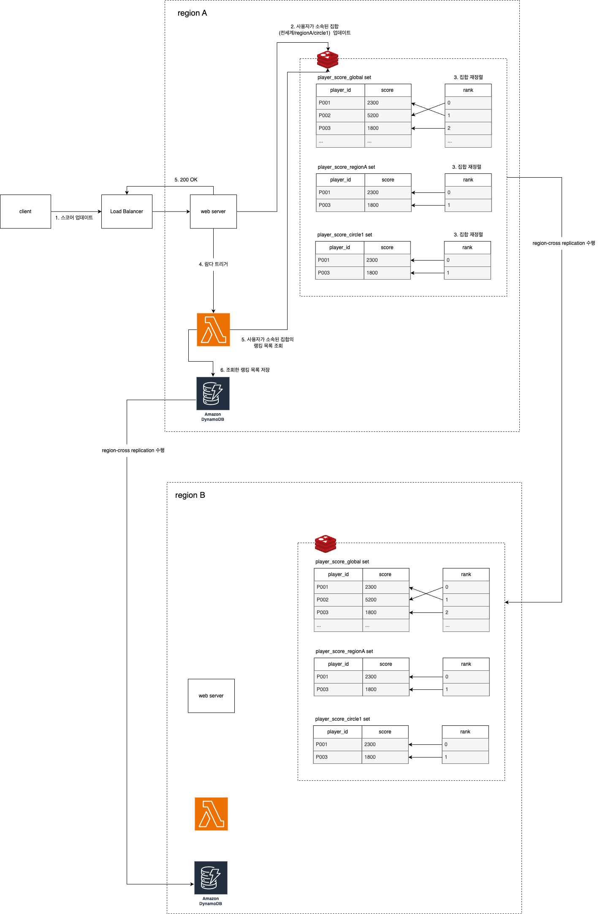
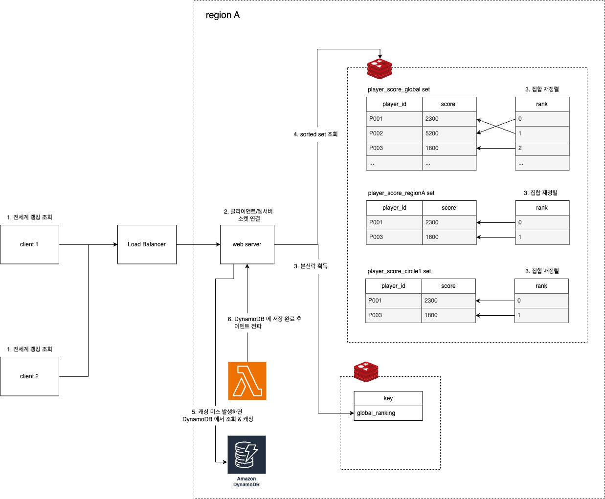

## Functional Requirements
* 사용자들은 가장 점수가 높은 사용자 10명의 이름과 점수를 조회한다.
* 사용자들은 전세계/지역/써클 단위로 랭킹을 분류해서 조회한다.
* 사용자들의 점수가 갱신될 때마다 리더보드(leaderboard)에 실시간으로 반영이 된다.

## Non Functional Requirements
* 쓰기 : 읽기 연산의 비율은 5 : 1 이다.
* 사용자들은 전세계에 분포되어있음을 감안한다.
* DAU 는 50만이고, 수천 명의 동시접속이 가능해야 한다.
* 고 가용성.
* 낮은 레이턴시.
* 확장 가능성.
* 오버헤드 최소화.

## Interfaces
#### 점수 갱신 요청
[Request]
  * 사용자 아이디
  * 게임에서 따낸 점수
  * 사용자 위치

[Response]
  * 200 OK

#### 상위 10명의 이름 및 점수 목록 요청
[Request]
* 분류 단위 (전세계/지역/써클)

[Response]
  * 사용자 이름
  * 점수
  * 순위

### Data Storage
* 사용자 수가 적으면 RDBMS + cache aside pattern 으로 구현해도 되겠지만 확장성을 보장하기 어렵다.
  * 사용자 별 랭킹을 집계하는 쿼리는 테이블 풀 스캔을 유도할 수 있다.
  * 랭킹 업데이트 빈도가 잦을수록 캐시에 실시간 정보 반영이 늦어질 가능성이 높다.
* 랭킹 정렬에 Redis sorted set 을 활용한다.
  * sorted set 에 원소가 upsert 될 때마다 정렬 수행. 
  * sorted set 안에 있는 원소들의 갯수가 N 이라고 할 때 sorted set 의 원소들을 정렬하는 데에 시간복잡도 logN 소요.

### Network protocol between Server and Client
* server-sent events 또는 web socket 

### How to update score of player

#### 1. 스코어 업데이트
RESTful API 으로 요청

#### 2. 사용자가 소속된 집합 업데이트
랭킹 집계는 전세계/지역/써클 단위로 해야 함을 감안하여 각 집계 그룹마다 sorted set 을 생성하고, 사용자가 소속된 모든 그룹에 대응하는 sorted set 에 스코어 변경

#### 3. 집합 재정렬
sorted set 내부에 멤버가 추가되거나 기존 멤버의 스코어가 변경될 때마다 레디스 내부에서 재정렬 수행 
#### 4. 람다 트리거 ~ 6. 조회한 랭킹 목록 저장
레디스에 저장된 랭킹 정보를 영속성 계층에 저장하는 과정은 비동기로 처리 (write-behind)

#### region-cross replication 수행
전 세계에서 각 지역의 데이터센터가 해당 지역의 트래픽을 서빙하는 것, 어느 한 지역의 데이터센터에
문제가 있더라도 가용성을 유지해야하는 것을 감안하여 replication 수행

### How to read leaderboard data

#### 1. 전세계 랭킹 조회
여러 명의 클라이언트가 동시에 전세계 랭킹 목록 조회

#### 2. 클라이언트/웹서버 소켓 연결
실시간으로 변경되는 랭킹을 제공해야 하기 때문에 웹 소켓 생성

#### 3. 분산락 획득
thundering herd problem 방지하기 위해 가장 먼저 소켓을 연결한 클라이언트 대상으로 분산락 획득 & 나머지 클라이언트들은 대기

#### 4. sorted set 조회 ~ 5. 캐싱 미스 발생하면 DynamoDB 에서 조회 & 캐싱
* 4 ~ 5번 과정이 끝나면 분산락 해제
* 대기중이었던 프로세스들은 차례대로 락을 획득 후 캐싱된 랭킹 목록 조회  

#### 6. DynamoDB 에 저장 완료 후 이벤트 전파
* `How to update score of player` 의 6번 완로 후 이벤트 전파
* 이벤트를 받은 웹 서버에서는 변경된 랭킹 목록 조회 & 소켓이 연결되어있는 클라이언트들에게 변경된 랭킹 목록 전달 

## 참고할 만한 레퍼런스
* [Leaderboard system design](https://systemdesign.one/leaderboard-system-design/#how-to-retrieve-the-leaderboard-data)
* [Redis sorted sets](https://redis.io/docs/latest/develop/data-types/sorted-sets/)
* [caching strategy and how to choose the right one](https://codeahoy.com/2017/08/11/caching-strategies-and-how-to-choose-the-right-one/)
* [thundering herd problem](https://velog.io/@gkdbssla97/Thundering-Herd-Problem%EC%9D%84-%EB%A7%88%EC%A3%BC%EC%B3%A4%EB%8B%A4)
