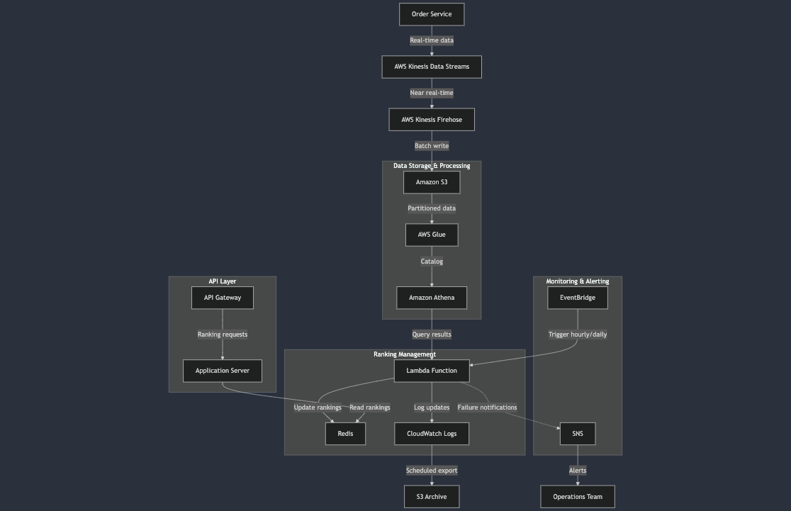

# Requirements

## Functional

- 카테고리별 실시간으로 매출 상위 100개의 제품 조회
  - 매일, 매주, 매월의 누적 매출 순위 확인
- 수천, 수만건의 매출건 처리 필요
- 실시간 데이터와 배치 처리된 랭킹 데이터 간의 일시적 불일치 허용 및 관리

## Non-Functional

- 낮은 지연시간
- 확장성
- 신뢰 가능
- 고가용성
- 모니터링

## Constraints

- 카테고리는 변경할 수 없고 중복 카테고리에 속할 수 없음
- 1시간마다 업데이트 되어야함
- CloudWatch Logs, S3 데이터 보존 기간 및 저장방식 설정 필요

## Estimates

- 카테고리 5개
  - 100만개의 제품
- 거래량 일평균 10만건
- 사용자 방문트래픽 50만건

## Design

1. OrderService -> AWS Kinesis stream/firehose -> S3 -> Athena + Glue

- 매출 데이터 저장 및 랭킹 생성을 위한 과정
- 랭킹 관련 데이터
  > - item_id
  > - item_name
  > - category
  > - date
  > - customer_gender
  > - customer_ages
- Kinesis Firehose에서 S3에 적재시 `category/YYYY-MM-DD-{N}H` 파티셔닝

1. Redis

- 일별: {category}:daily:{YYYYMMDD}:ranking
- 주별: {category}:weekly:{YYYYWW}:ranking
- 월별: {category}:monthly:{YYYYMM}:ranking
- TTL: 일별 25시간, 주별 192시간, 월별 792시간
- 자료구조: Sorted Sets

3. Lambda

- 레디스 랭킹관리 스케줄러 수행 후 내역을 CloudWatch Logs로 저장
- CloudWatch Logs를 EventBridge로 정기적 내보내기 방식으로 용량 관리
- 실패 처리시 함수 재시도 및 알림 설정

### 랭킹 관리

1. 매시간 정각 -> 일별 랭킹 업데이트
2. 매일 자정 -> 일별, 주별, 월별 랭킹 모두 업데이트 및 정리

## API

- 카테고리별 랭킹 확인
  [GET] /ranking/{category}/{timeType}

## Reference

### 함께 논의하고 싶은 주제

- BI Tool과 통합하여 데이터 분석 영역 확장을 위한 파이프라인 구성
- 랭킹시스템을 확장하여 추천시스템 구축

### 참고하기 좋은 기술 사례

[예시-랭킹시스템 아키텍쳐](https://github.com/donnemartin/system-design-primer/blob/master/solutions/system_design/sales_rank/README.md)
