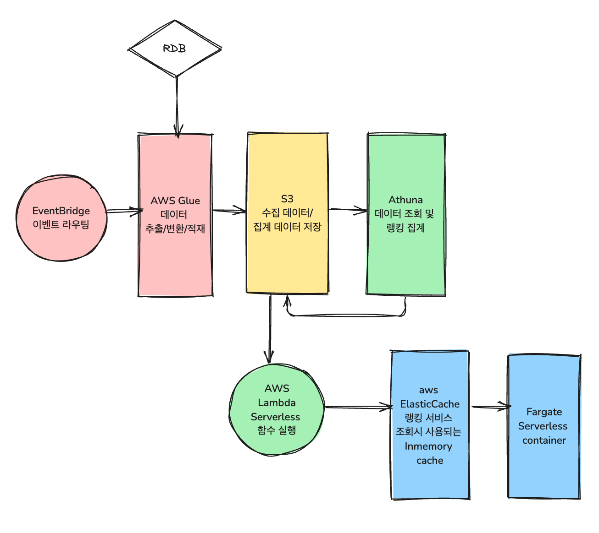

## Requirements
### Functional
* 수만여개의 상품을 필터별 랭킹을 매기고 조회할 수 있다.
* 비정상적 주문 활동이 랭킹에 반영되지 않도록 한다.
### Non-Functional
* 기능에 대해 유연성, 확장성 보장
* 빠른 처리(집계) 성능 보장
* 데이터 활용성
### Estimates

## Design

### Batch: aws Glue 
* 병렬 데이터 수집
### Event 기반
* EventBridge

## Reference

### 함께 논의하고 싶은 주제
* serverless 아키텍쳐 운영 경험
  * 장애, 비용 등의 내용

### 참고하기 좋은 기술 사례
* [serverless-architecture-patterns](https://waswani.medium.com/serverless-architecture-patterns-in-aws-edeab0e46a32)
