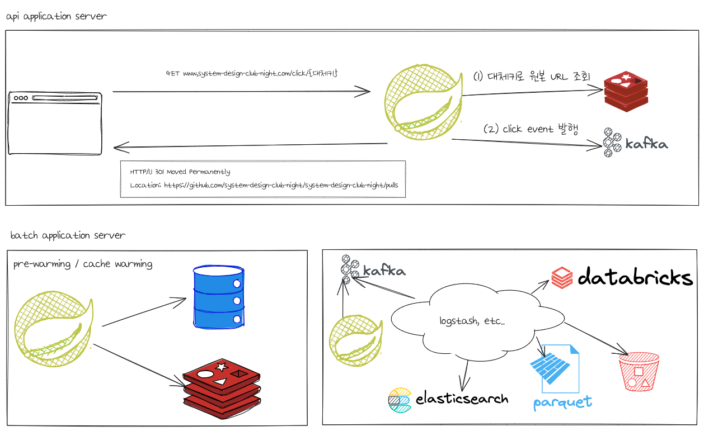

## Requirements
  ### Functional
  * url을 클릭하면, 원본 페이지로 이동한다.
  
## Design


## API
### request
```
https://system-design-club-night.com/click/{대체키}
```

### response
```
HTTP/1.1 301 Moved Permanently
Location: https://github.com/system-design-club-night/system-design-club-night/pulls
```
> 301 Moved Permanently은 리소스가 영구적으로 이동했음을 나타내는 상태코드이다.  브라우저와 검색 엔진에게 URL이 항상 새로운 위치로 변경되었다는 것을 알린다.
  

## Consumer
필요한 경우 구현한다. 

## Reference
* [baeldung: Redirection Status Codes: 301, 302, 307, and 308](https://www.baeldung.com/cs/redirection-status-codes#301-redirection)
  
## 이어서: 함께 논의하고 싶은 주제 
### 대체키
#### 대체키의 목적 및 사례 
##### (1) URL에 담아야하는 파라미터가 긴 경우
**목적**
* 심미성이 떨이지는 경우 
* GET url에 포함되어야하는 파라미터가 2000자가 넘는 경우

**사례**
* shorten url이 필요한 케이스
    * kibana 공유하기 
    * 구글시트 공유하기
   * 파라미터 변조를 막아야하는 경우
      * 페이지가 랜딩될 때, 담겨야하는 파라미터가 정확해야하는 경우  
        * 트래킹솔루션 URL
* 추천링크        
  * 상품 추천하고 적립받기 
  * 회원가입 추천하고 적립받기 
   
##### (2) 보안이 중요한 경우
**목적**
* 인증/인가가 없지만, 쉽게 탈취되면 안되는 경우 

**사례**
* 선물하기 링크
* 결제하기 링크
  * [서비스-결제선생](https://payssam.kr/use)
* 네컷사진 다운로드 링크

### 참고하기 좋은 기술 사례
* [최범균님의 유튜브: ID 뭐로만들지](https://youtu.be/gKbGIA7njQo?si=s1hzVFhnK7M4FcRy)
