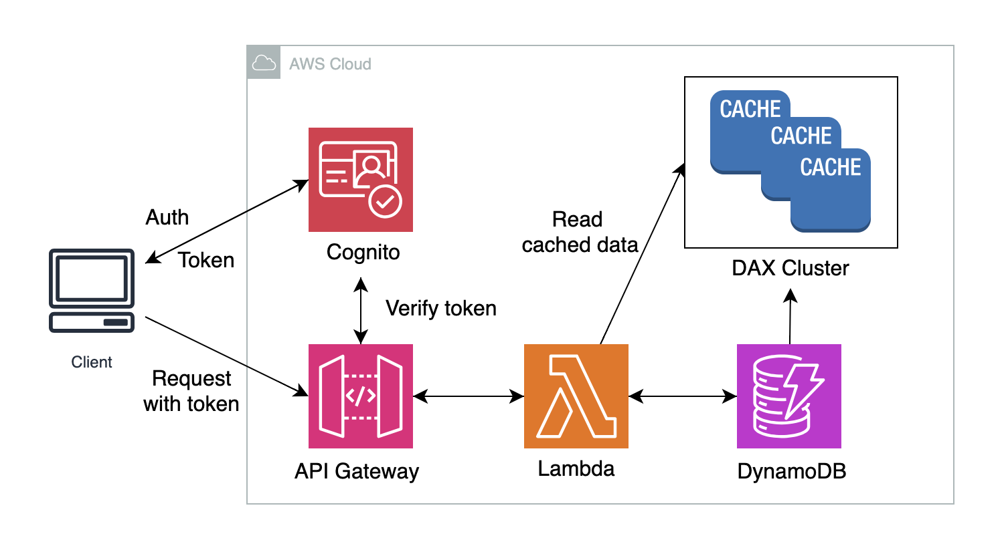

# Requirements

## Functional

- 순간 대용량 트래픽에 따른 적절한 캐시 전략을 활용 및 확장이 가능해야 한다.
- 사용자당 생성 가능한 단축 URL의 수가 제한되어 있다.
- 단축 URL은 신뢰할 수 있는 사이트/유저만 등록할 수 있다.
- 단축 URL 클릭 수를 확인 할 수 있어야 한다.
- 단축 URL을 적절한 만료시간에 따라 생성하고 삭제할 수 있어야 한다.
- 단축 URL을 통해 원래 URL로 리디렉션이 되어야 한다.

## Non-Functional

- URL 리디렉션이 성공적으로 수행되어야 한다.
- 낮은 지연성으로 처리되어야 한다.
- 미인증 사용자거나 짧은 시간내 연속 생성 요청을 방지해야 한다.

## Estimates

- 일일 활성 사용자 수 (DAU): 50,000명
- 사용자당 일일 URL 생성 요청 수: 5회
- 단축 URL 길이: 100바이트 이하

-> 요청량 증가에 따른 비용을 감소시키기 위해선 API Gateway 앞에 CloudFront를 추가도입  
(API Gateway가 요청당 비용측정을 하기 때문에 횟수를 감소시키는게 효과적)

## Design

### Infra

1. Cognito

- 유저풀을 관리로 인증/인가

2. API Gateway

- 클라이언트별 요청량 제한(API Gateway-Usage Plan 사용)

3. Lambda

- 서버리스로 단축 URL 처리

4. DynamoDB

- 데이터 키-값 관리

5. DynamoDB Accelerator(DAX)

- DynamoDB 호환 캐싱서비스

### Code

**URL 인코딩 방법**

- Base62 사용(AZ,az,0-9 => 62개로 조합)
  - '7자'의 경우 62^7 ~= 35000억 개 제공

### API

1. 생성  
   -> 기본 URL로 단축 URL 만들기
   - [POST] /api
   - Req: body(json)
     - apiKey: string (사용자 인증키)
     - ttl: number (만료시간 최소1시간-최대30일)
     - url: string (리디렉션 대상 URL)
2. 조회
   -> 생성한 URL들 확인
   - [GET] /{tinyUrl}
   - Req: param
     - apiKey: string (사용자 인증키)
   - Res
     - StatusCode
       - 404 (fail)
       - 302 (Success)
3. 삭제
   -> 미사용 단축 URL 삭제
   - [DELETE] /api
   - Req: param
     - apiKey: string (사용자 인증키)
     - tinyUrl: string (생성된 단축 URL)

### Database

- TTL 설정을 통해 URL의 만료기간 초과시 삭제처리
- Auto Scaling 가능
- '조건부 쓰기'를 통해 URL 테이블의 `originalUrl`이 중복여부를 확인하고 쓰기작업 진행 (만약 이미 존재한다면 기존값 반환)

#### User Table

| Field         | Type   | Description                   |
| ------------- | ------ | ----------------------------- |
| userId        | String | Primary Key                   |
| userName      | String | 사용자 이름                   |
| apiKey        | String | API 키                        |
| totalUrlCount | Number | 사용자가 생성한 URL 총 수     |
| createdAt     | Number | 사용자 생성 시간 (타임스탬프) |

#### URL Table

| Field       | Type   | Description                |
| ----------- | ------ | -------------------------- |
| urlId       | String | Primary Key                |
| originalUrl | String | 원본 URL                   |
| tinyUrl     | String | 단축 URL                   |
| apiKey      | String | 생성한 사용자의 API 키     |
| createdAt   | Number | URL 생성 시간 (타임스탬프) |
| ttl         | Number | Time To Live (만료 시간)   |

## Reference

### 함께 논의하고 싶은 주제

- 멤버십별 URL 생성 한도
- QR코드 생성도 비슷한 아키텍쳐로 만들 수 있지않을까
- '리타게팅 링크'로 마케팅 분야에서 쓰이는데 활용할 수 있을까 (참고: [애드샐러드](https://adsalad.co.kr/feature))
  - '리타게팅': 이전에 내 사이트에 접속한 클라이언트의 쿠기를 기억해서 다시한번 광고를 노출시키는 기법

### 참고하기 좋은 기술 사례

[Lambda URL+CloudFront 조합](https://www.youtube.com/watch?v=9aWze0pGd7Y&list=WL&index=15)  
[tinyUrl 요구사항이 잘 나와잇음](https://www.educative.io/courses/grokking-modern-system-design-interview-for-engineers-managers/requirements-of-tinyurls-design)  
[AWS Serverless Achitecture Diagram](https://medium.com/aws-lambda-serverless-developer-guide-with-hands/secure-microservices-with-api-gateway-using-amazon-cognito-user-pools-28ac32afeee2)  
[API Gateway 처리량 제한](https://docs.aws.amazon.com/apigateway/latest/developerguide/api-gateway-request-throttling.html)
