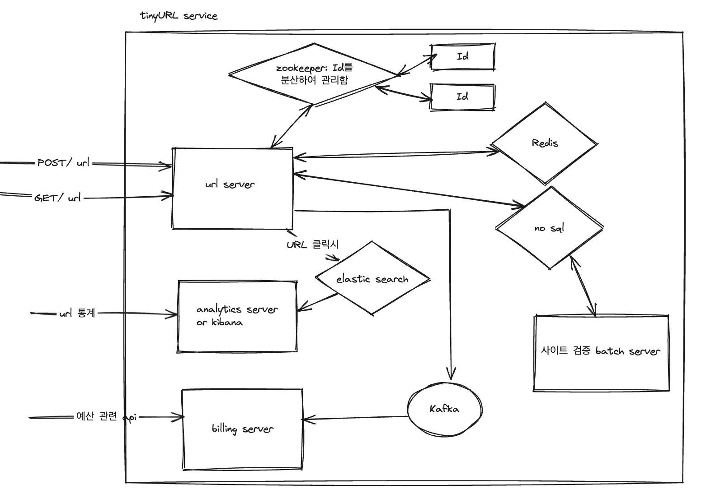

## Requirements
### Functional
* 단축 URL 유입분석을 위한 데이터를 제공해야한다.
  * HTTP referer를 확인할 수 있어야한다.
  * 시간당 클릭수를 확인할 수 있어야한다.
* 순간 대용량 트래픽이 발생하는 경우, DB에 부하를 일으킬 수 있다. 적절한 캐시 전략을 활용해야한다. 
* 단축 URL은 호출할 수 있는 횟수가 제한되어 있다. 
  * 단축 URL은 클릭당 비용이 과금된다. 충전된 예산에서 10분 단위로 비용이 차감되는 구조이다. 
  * TPM은 10만건 이상이다.
* 단축 URL은 신뢰할 수 있는 사이트만 등록할 수 있다. 
  * 10분마다 페이지가 신뢰할 수 있는지 검수할 수 있어야 한다.
  * 단축 URL은 최소 2만개 이상이 등록되어 있다.

### Non-Functional
* tinyUrl read 가 write 보다 많다.
* 확장성, 가용성: 대규모의 트래픽이 몰려도 장애없이 url을 redirection 할 수 있어야 한다.

### Estimates
* TPS 600만 이상

## Design

## API
* POST /v1/tiny-url
* GET /v1/tiny-url
* DELETE /v1/tiny-url
* GET /v1/analytics/url

## Message Queue
* 단축 URL 을 사용시 비용 처리를 위한 MQ 사용

## Batch
* 사이트 검증을 위한 10분 배치

## Caching 
* read 요청이 상대적으로 많음 -> tiny-url을 등록할 때 DB, cache 모두 write 하는 write-through 전략 사용

## Reference
* 가상 면접 사례로 배우는 대규모 시스템 설계 1
* [유투브 URL Shortener 시스템디자인 해보기](https://youtu.be/A7VkW8jGWZU?si=7k_1s8RTySkhTkAg)

### 함께 논의하고 싶은 주제
* 사이트 검증에 대한 방법 🤔

### 참고하기 좋은 기술 사례
* [base64](https://developer.mozilla.org/ko/docs/Glossary/Base64)
